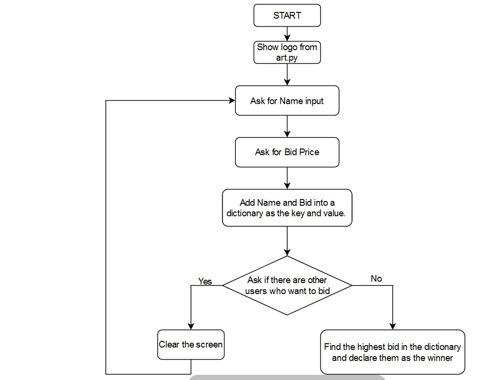

<h1 style = "text-align: center"> Secret Auction 💰 </h1>

<h2 style = "text-align: center"> Software Requirements</h2>

<figure> 

<figcaption style = "text-align: center">Figure 1.1: Secret Auction Flowchart</figcaption>

</figure>